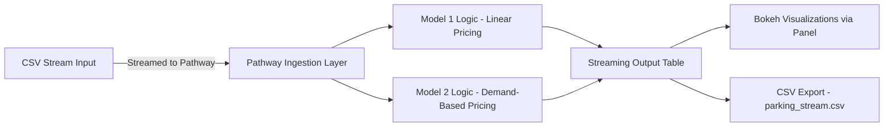

# 📌 Dynamic Pricing for Urban Parking Lots

Capstone Project | Summer Analytics 2025

---

## 📖 Overview

This project addresses the inefficiencies caused by static pricing in urban parking lots. We developed a dynamic, real-time pricing engine that updates parking fees based on demand, queue length, traffic conditions, and special events. The solution uses real-time data streaming and logic-based modeling to improve parking lot utilization.

---

## 🛠 Tech Stack Used

* **Python**
* **Pandas & NumPy** – For data manipulation and model logic
* **Pathway** – For real-time data ingestion, processing, and streaming
* **Bokeh + Panel** – For real-time data visualization
* **Google Colab** – Development environment
* **GitHub** – Version control and documentation

---

## 🧱 Architecture Diagram (Mermaid Syntax)

---

## 🔄 Project Architecture and Workflow

1. **Data Streaming**: The dataset (CSV) is read using `Pathway` in streaming mode with one row per second simulation.

2. **Model 1 (Linear)**:

   * Computes price based on occupancy rate.
   * Formula: `Price = BasePrice + α * (Occupancy / Capacity)`
   * Serves as a baseline.

3. **Model 2 (Demand-Based)**:

   * Constructs demand based on occupancy, queue length, traffic, special day, and vehicle type.

   * Demand formula:

     `Demand = α * (Occupancy / Capacity) + β * QueueLength - γ * Traffic + δ * IsSpecialDay + ε_vehicle`

     `Price = BasePrice * (1 + λ * NormalizedDemand)`

   * Normalized demand ensures smooth and bounded pricing (0.5x to 2x base).

4. **Real-Time Windows**:

   * Daily tumbling windows used for smoothing fluctuations.

5. **Visualization**:

   * Bokeh plots are created in Panel.
   * Users can interactively view prices per lot and compare with competitors.

6. **Output**:

   * All processed results are streamed and saved to `parking_stream.csv`

---

## 📎 Documentation & References

* [Pathway Developer Guide](https://pathway.com/developers/user-guide/introduction/first_realtime_app_with_pathway/)
* [Bokeh Documentation](https://docs.bokeh.org/en/latest/index.html)
* [Mermaid Live Editor](https://mermaid.live/edit)
* Dataset provided by Consulting & Analytics Club, IIT Guwahati
---
